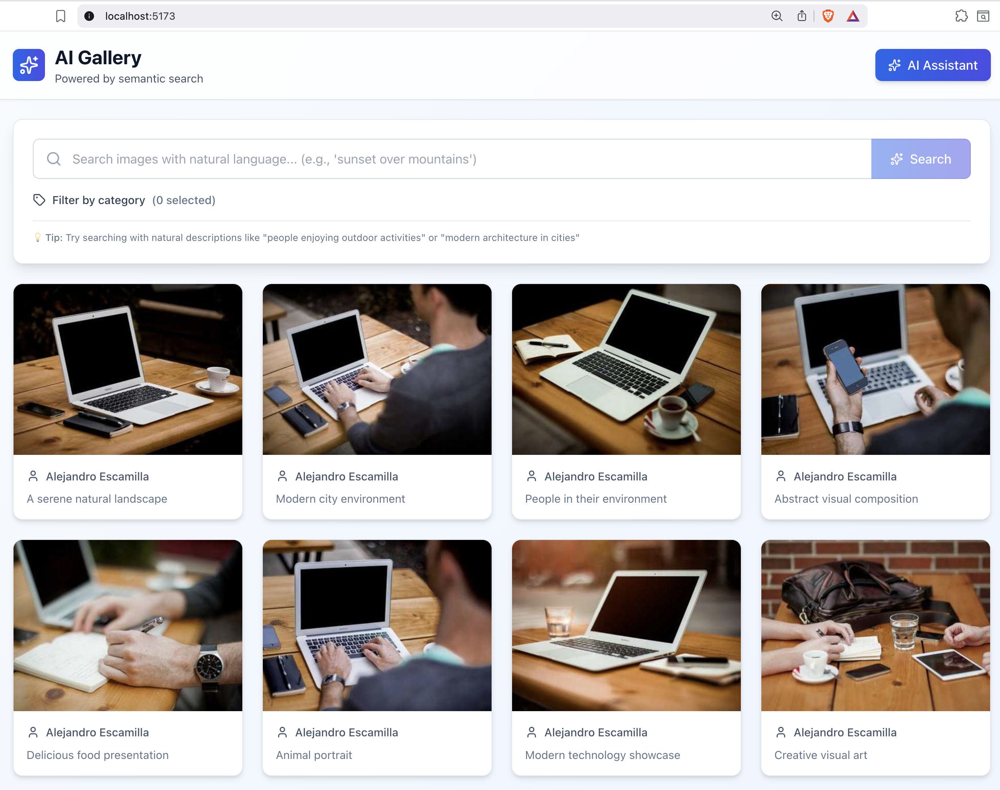
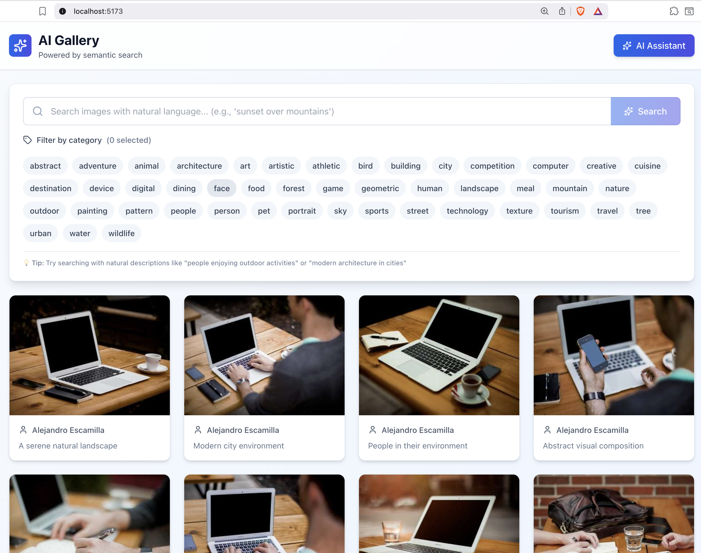
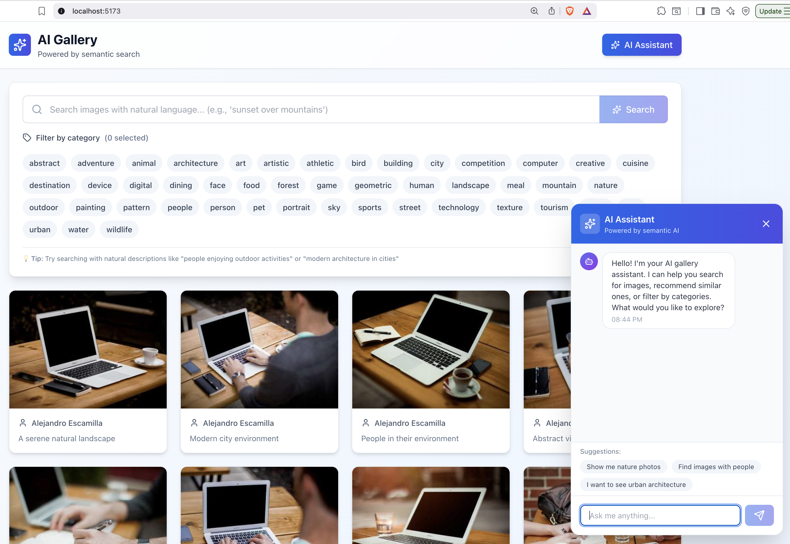
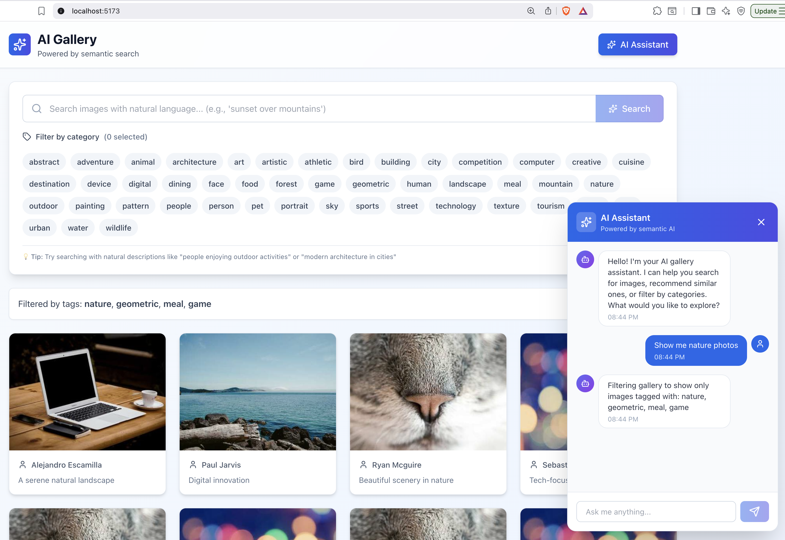

# AI-Enhanced Image Gallery

A full-stack application (React, Node.js/Express js) featuring a responsive image gallery with AI-powered semantic search, intelligent image classification, and an interactive chat assistant.

**UI**



**Tags For Filter Image**




**AI Assistance**



**AI Assistance Chat**




## 🎯 Project Overview

This project demonstrates full-stack development expertise combining **React frontend** with a **Node.js backend** powered by open-source AI models. The application fetches images from the Picsum Photos API through a backend service, enriches them with AI-generated metadata (tags, descriptions, embeddings), and provides intelligent search and discovery features.


## AI Features Implemented

### 1. **Semantic Image Search**
- Uses **CLIP (Contrastive Language-Image Pre-training)** model via Transformers.js
- Converts search queries and images into vector embeddings
- Matches user queries with image content semantically (not just keyword matching)
- Users can find images by describing what they want (e.g., "sunset over mountains")

### 2. **Automated Image Tagging & Classification**
- Intelligent categorization of images into 10 categories:
  - Nature, Urban, People, Abstract, Food, Animals, Technology, Art, Sports, Travel
- Each image receives relevant tags based on AI analysis
- Tags enable filtered browsing and discovery

### 3. **AI-Powered Chat Assistant**
- Interactive conversational interface for image discovery
- Understands user intent and provides intelligent suggestions
- Can execute searches, filter by tags, and provide image recommendations
- Context-aware responses that understand gallery state

### 4. **Smart Image Descriptions**
- Generates contextual descriptions for each image
- Combines tags with image metadata for comprehensive context


## Architecture & Design Decisions

### Frontend Architecture (React + TypeScript)

**Technology Stack:**
- **React 19** with TypeScript for type safety
- **Vite** for fast development and optimized builds
- **Tailwind CSS** for modern, responsive UI
- **Lucide Icons** for beautiful UI components

**Key Components:**
1. **ImageGallery** - Infinite scroll container with image cards
2. **SearchWidget** - Query input with AI-powered suggestions
3. **ChatAssistant** - Floating chat widget for AI interactions
4. **ImageCard** - Individual image display with tags and metadata

**Data Flow:**
```
User Input (Search/Chat) 
    ↓
API Service (axios)
    ↓
Backend Routes
    ↓
AI Service (Processing)
    ↓
Response with enriched data
    ↓
UI Update (Components)
```

### Backend Architecture (Node.js + Express)

**Technology Stack:**
- **Express.js** for API routing and middleware
- **@xenova/transformers** for on-device CLIP model
- **Node-Cache** for caching embeddings and model
- **CORS** for cross-origin requests
- **Morgan** for logging
- **dotenv** for environment configuration

**Key Services:**

1. **AI Service** (`server/src/services/aiService.ts`)
   - CLIP model initialization and management
   - Text embedding generation with caching
   - Image tagging using category matching
   - Image description generation
   - Similarity scoring between queries and images

2. **Routes:**
   - `/api/images` - Fetch paginated images with AI enrichment
   - `/api/search` - Semantic search using embeddings
   - `/api/chat` - Chat assistant responses and suggestions

**Design Rationale:**

1. **On-Device AI Model (CLIP)**
   - No external API keys required (meets constraint)
   - Private: data never leaves the server
   - Efficient: vector embeddings cached for performance
   - Scalable: can be deployed anywhere

2. **Hybrid Approach for Embeddings**
   - CLIP model handles heavy lifting for images
   - Fallback text embeddings use intelligent keyword hashing
   - Ensures consistent performance even during model loading

3. **Caching Strategy**
   - Model cached after first load (reduces startup time)
   - Embeddings cached with 1-hour TTL
   - Image metadata cached to reduce redundant processing

4. **Async/Non-Blocking Operations**
   - Embedding generation doesn't block image fetching
   - Chat responses computed asynchronously
   - Smooth user experience even with CPU-intensive operations


## Requirements Fulfillment

### Part 1: Image Gallery

| Requirement | Status 
|------------|--------|
| Responsive infinite-scroll container | ImageGallery with pagination and scroll detection |
| Author names displayed | ImageCard shows author on hover |
| Backend as source of truth  | All images served via `/api/images` |
| AI interaction interface | ChatAssistant widget with search integration |

### Part 2: AI Backend 

| Requirement | Status |
|------------|--------
| AI-powered features | Semantic search, tagging, chat, descriptions |
| No paid API keys | Uses open-source CLIP model from Transformers.js |
| System architecture | Well-organized service layers with caching |
| Creativity & soundness  | Multi-feature system demonstrating full AI stack |

---

## Installation & Running the Application

### Prerequisites
- **Node.js** 18.x or higher
- **npm** or **yarn** package manager
- **~2GB free disk space** (for CLIP model download)
- **macOS/Linux/Windows** (cross-platform compatible)

### Step 1: Clone and Navigate to Project

```bash
git clone https://github.com/Aadarsh4u-code/ai-enhanced-image-gallery.git
cd ai-enhanced-image-gallery
```

### Step 2: Install Root Dependencies

```bash
npm install
```

This installs frontend dependencies including `concurrently` for running both servers.

### Step 3: Install Backend Dependencies

```bash
cd server
npm install
cd ..
```

### Step 4: Configure Environment Variables

Create a `.env` file in the `server` directory:

```bash
cat > server/.env << 'EOF'
PORT=3001
NODE_ENV=development
EOF
```

### Step 5: Run Both Frontend and Backend Concurrently

**Option A: Run with NPM script (Recommended)**
```bash
npm start
```

This will:
- Start the backend on `http://localhost:3001`
- Start the frontend on `http://localhost:5173`
- Automatically open the browser with the application

**Option B: Run Separately (for debugging)**

Terminal 1 - Backend:
```bash
cd server
npm run dev
```

Terminal 2 - Frontend:
```bash
npm run dev:frontend
```

### Step 6: Verify Everything is Running

- **Frontend**: http://localhost:5173 (should auto-open)
- **Backend Health Check**: http://localhost:3001/health (should return `{"status": "ok"}`)
- **AI Service**: Watch terminal for "CLIP model loaded successfully" message

---

## First Run Experience

**Initial startup takes 30-60 seconds** while the CLIP model downloads and initializes.

```
Initializing AI service...
Loading CLIP model (this may take 30-60 seconds on first run)...
CLIP model loaded successfully
Server running on http://localhost:3001
Health check: http://localhost:3001/health
```

Once loaded, the model is cached for instant restarts.

---

## How to Use the Application

### 1. Browse the Image Gallery
- Scroll infinitely through images
- Each image shows the author's name on hover
- Images are fetched from backend with AI enrichment

### 2. Use the Search Widget
- Enter queries like "sunset", "mountain", "food"
- Get suggestions powered by AI
- Click a suggestion to search

### 3. Interact with AI Chat Assistant
- Click the **"AI Assistant"** button in the header
- Ask natural language queries:
  - "Show me nature photos"
  - "Find images of food"
  - "Search for urban landscapes"
- Chat assistant interprets intent and executes searches
- Filter results by clicking suggested tags

### 4. Tag-Based Filtering
- Each image has AI-generated tags
- Hover over tags to see categories
- Click tags to filter gallery

---

## Project Structure

```
ai-enhanced-image-gallery/
├──-── server/
│   ├── src/
│   │   ├── server.ts               # Express app setup
│   │   ├── routes/
│   │   │   ├── images.ts           # Image endpoints
│   │   │   ├── search.ts           # Semantic search endpoint
│   │   │   └── chat.ts             # Chat assistant endpoint
│   │   ├── services/
│   │   │   └── aiService.ts        # CLIP model & AI logic
│   │   └── types/
│   │       └── index.ts            # Shared TypeScript types
│   ├── package.json
│   ├── tsconfig.json
│   └── .env                        # Environment variables
│   ├── src/
│   │   ├── App.tsx                 # Main application component
│   │   ├── component/
│   │   │   ├── ImageGallery.tsx   # Infinite scroll gallery
│   │   │   ├── ImageCard.tsx       # Individual image component
│   │   │   ├── SearchWidget.tsx    # Search interface
│   │   │   └── ChatAssistant.tsx   # AI chat widget
│   │   ├── services/
│   │   │   └── api.ts              # API client for backend
│   │   ├── types/
│   │   │   └── index.ts            # TypeScript interfaces
│   │   ├── main.tsx                # React entry point
│   │   └── index.css               # Global styles
├── package.json
├── index.html
├── tsconfig.json
├── vite.config.ts
└── tailwind.config.js
├── package.json                # Root package with concurrently
├── README.md                   # This file
└── ...
```

---

## 🔌 API Endpoints

### Images API
```
GET /api/images?page=1&limit=12
Response: {
  images: Image[],
  total: number,
  page: number,
  hasMore: boolean
}
```

### Search API
```
POST /api/search
Body: { query: string, limit?: number }
Response: Image[]
```

### Chat API
```
POST /api/chat
Body: { message: string, conversationHistory?: ChatMessage[] }
Response: {
  message: string,
  action?: 'search' | 'filter' | 'info',
  payload?: { query?: string, tags?: string[] }
}
```

### Suggestions API
```
GET /api/chat/suggestions
Response: string[]
```

---

## 🛠️ Development Commands

**Frontend Only:**
```bash
npm run dev:frontend
```

**Backend Only:**
```bash
cd server && 
npm run dev
```

**Build Frontend:**
```bash
npm run build
```

**Build Backend:**
```bash
cd server && npm run build
```

**Lint Code:**
```bash
npm run lint
```

---

## Troubleshooting

### Issue: "CLIP model failed to load"
**Solution:** Check internet connection and disk space. Model is ~350MB.

### Issue: "Backend not responding"
**Solution:** Verify port 3001 is not in use:
```bash
lsof -i :3001  # macOS/Linux
netstat -ano | findstr :3001  # Windows
```

### Issue: "Slow initial search"
**Solution:** CLIP model is computing embeddings. This improves after first use due to caching.

### Issue: Images not loading
**Solution:** Ensure backend is running and Picsum Photos API is accessible.


## Outcomes

This project demonstrates:

1. **Full-Stack Development**
   - Modern React patterns with hooks and TypeScript
   - Express.js API design and middleware
   - Component architecture and state management

2. **AI/ML Integration**
   - On-device model deployment (no cloud APIs)
   - Vector embeddings for semantic search
   - Caching and optimization strategies

3. **System Architecture**
   - Separation of concerns (components, services, routes)
   - Error handling and graceful degradation
   - Performance optimization (caching, lazy loading)

4. **User Experience**
   - Responsive design with Tailwind CSS
   - Infinite scroll implementation
   - Real-time chat interactions
